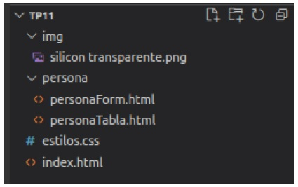

# CURSO PROGRAMACIÓN WEB FULL STACK (NIVEL 2)

## Módulo 6 - Programación FrontEnd Trabajo Práctico 11

- 1)_ Crear la siguiente estructura de archivos/carpetas

### carpetas:
- **img**: para luego incorporar imagenes
-  **persona**:
   -  archivo `personaForm.html`: contendra el form para crear personas
   -  archivo `personaTabla.html`: contendra la tabla con las personas existentes en el proyecto
-  archivo index.html: contendra la página principal.
-  archivo estilos.css: contendrá los estilos

---

- 2)_ Debemos llegar a una página como la siguiente:

### Página Inicio

### Listar Personas

### Gestión Personas

---

## Detalles Generales

### Título

- alineacion del texto centrado
- color texto: white
- padding: 20px
- color fondo: darkblue
- borde: 2 pixeles, solido, darkblue

### Imagen silicon

descargarse la imagen de: https://drive.google.com/file/d/1LKnTQVao5uU60vchWztGApvriQIZQ3lp/view?usp=sharing y ubicarla en la carpeta img del proyecto.
La img debe colocarse en el elemento del titulo para que use dicho espacio y no quede por debajo.

### css:

- *alineacion vertical*: **middle** (para que el titulo se centre verticalmente a la imagen)
- *posicion*: **absolute, left = 20px** (para que la imagen se incorpore a la izquierda del titulo)

### Menu

EL menu se conforma de **2 enlaces** incorporados dentro de algun elemento de bloque. El enlace debe apuntar a `persona/personaForm.html` y `personaTabla.html` respectivamente.
Se usaron **iconos** de ***google icons***. podrían usar el icono que mas les guste para la ocasión.

### css Componente que envuelve al menu:

- padding: **5px**
- alineacion texto: **center**
- color fondo: **#e4e4e4**

### css Enlaces del menu

- borde: **sólido, 1px color, gray**
- padding: **5px**
- tamaño de la fuente: **25px**
- color fuente: **darkblue**

### Título

- fondo: **#e4e4e4**
- Analizar **margin/padding** para que se visualice similar a la imagen presentada en el ejemplo.

## Página Listar personas

Cabecera y menu igual a HOME.

### Tabla

- *table, tr, th,td*
  - border **colapsado**
  - border **1px**
  - border **solid**
  - border **black**
  - tamaño fuente: **20px**
- *th*:
  - fondo: **#e4e4e4**
- *table*
  - ancho: **70%**
  - Analizar y ver alternativa para **centrar la tabla a la pagina** como se ve en el ejemplo.

---
## EL trabajo deben comprimir en .zip la carpeta y subirlo al canvas.

