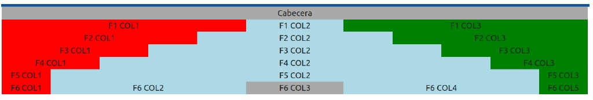
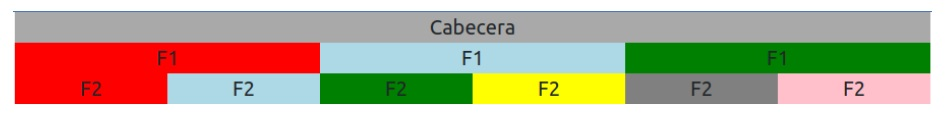
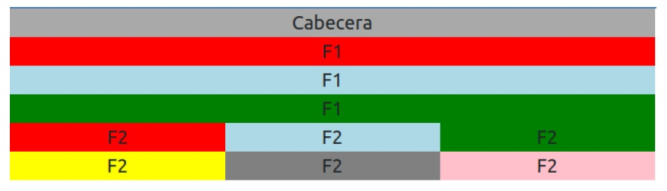

# CURSO PROGRAMACIÓN WEB FULL STACK (NIVEL 2)

## Módulo 6 - Programación FrontEnd Trabajo Práctico 12 (Bootstrap grid system)

### Ejercicio 1

Crear el documento `tp12ej1.html` con la estructura **html** necesaria para incorporar componentes
**bootstrap**, le agregamos un *contenedor* del tipo *container* y agregaremos *filas* y *columnas* de
manera de imitar la imagen que esta a continuacion, tratando también de imitar los *colores*
elegidos.

---

### Ejercicio 2

Crear el documento `tp12ej2.html` con la estructura **html** necesaria para incorporar componentes
**bootstrap**, le agregamos un *contenedor* del tipo *container* y agregaremos *filas* y *columnas* de
manera de imitar la imagen que esta a continuación, tratando también de imitar los *colores*
elegidos.

### Para pantallas MD:

### Para pantallas SM:

---

### Para presentar el TP deben subirlo a su repositorio GIT y compartir el enlace en el aula virtual.
